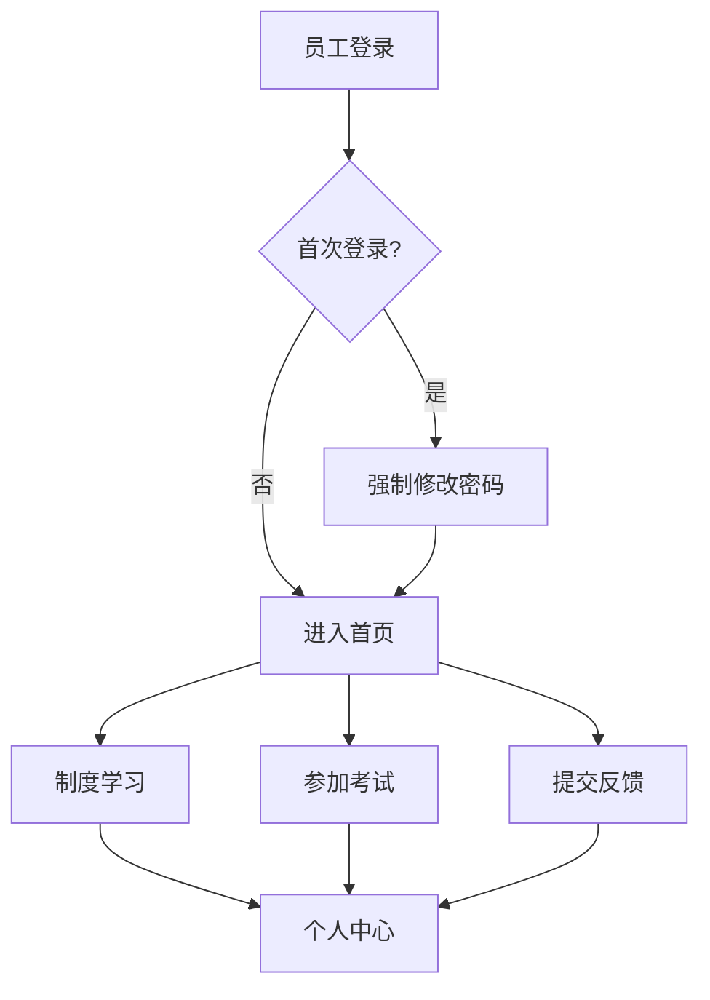

# 制度学习与问题反馈平台 - 产品需求文档 (PRD)

## 1. Product Overview

制度学习与问题反馈平台是一个面向企业内部员工的学习系统，提供制度内容学习、在线考核测试和问题反馈功能，同时配备完整的后台管理系统。

- 解决企业内部制度学习、考核和反馈的需求，提高员工对制度的理解和执行能力，同时为管理层提供有效的管理工具
- 目标用户：企业员工和管理层

## 2. Core Features

### 2.1 User Roles

| Role | Registration Method | Core Permissions |
|------|---------------------|------------------|
| 普通员工 | 工资编号+身份证后六位登录 | 学习制度、参加考试、提交反馈、查看个人中心 |
| 管理员 | 管理员账户登录 | 完整的后台管理权限，包括内容管理、用户管理、反馈管理 |

### 2.2 Feature Module

1. **前台首页**: 导航栏、公告栏、制度学习入口、考试入口、反馈入口
2. **制度学习页面**: 分类浏览、搜索、PDF文档展示（带水印）
3. **在线考试页面**: 考试列表、在线答题、自动评分、考试历史
4. **问题反馈页面**: 问题提交、反馈列表、常见问题、回复通知
5. **个人中心**: 个人信息、学习记录、考试记录
6. **后台管理首页**: 数据概览、快捷操作
7. **内容管理页面**: 分类管理、制度管理、考试管理、题库管理
8. **用户管理页面**: 用户账户管理、批量导入用户、部门管理、岗位管理、权限设置
9. **反馈管理页面**: 问题处理、常见问题维护、问题统计

### 2.3 Page Details

| Page Name | Module Name | Feature description |
|-----------|-------------|---------------------|
| 前台首页 | 公告栏 | 显示系统重要公告，支持富文本 |
| 制度学习页面 | PDF文档展示 | 在线渲染PDF，添加用户姓名和时间水印，禁用下载和打印，禁用右键菜单 |
| 制度学习页面 | 分类浏览 | 树形分类展示，按分类筛选制度 |
| 在线考试页面 | 在线答题 | 支持选择题、判断题，考试倒计时，超时自动交卷 |
| 在线考试页面 | 自动评分 | 提交后立即显示成绩、正确答案和解析 |
| 问题反馈页面 | 问题提交 | 支持标题、内容、附件上传 |
| 个人中心 | 个人信息 | 展示姓名、部门、岗位、学习统计、考试统计 |
| 后台管理-用户管理 | 批量导入用户 | 支持Excel批量导入，验证数据格式，导入预览 |
| 后台管理-内容管理 | 制度文档上传 | 上传PDF，设置分类、权限、有效期 |
| 后台管理-权限管理 | 权限设置 | 按部门、岗位设置制度访问权限 |

## 3. Core Process

### 员工学习流程
1. 员工使用工资编号和身份证后六位登录系统
2. 首次登录强制修改密码
3. 浏览制度分类或搜索制度
4. 查看PDF文档（带水印）
5. 参加相关考试
6. 如有疑问提交反馈
7. 在个人中心查看学习和考试记录

### 管理员管理流程
1. 管理员登录后台
2. 批量导入用户或手动创建用户
3. 创建制度分类和岗位部门
4. 上传制度文档并设置水印
5. 配置访问权限
6. 创建考题和发布考试
7. 处理员工反馈问题
8. 查看统计数据和报表

## 4. User Interface Design

### 4.1 Design Style

- **主色调**: 蓝色系 (#1890ff) - 专业、稳重
- **辅助色**: 绿色 (#52c41a) - 成功、橙色 (#faad14) - 警告、红色 (#f5222d) - 错误
- **按钮风格**: 圆角按钮，带悬停效果
- **字体**: 思源黑体，层级分明
- **布局风格**: 卡片式布局，顶部导航
- **图标风格**: Element Plus 图标库

### 4.2 Page Design Overview

| Page Name | Module Name | UI Elements |
|-----------|-------------|-------------|
| 前台首页 | 导航栏 | 顶部固定，包含logo、导航菜单、用户头像 |
| 前台首页 | 公告栏 | 轮播展示，蓝色背景，白色文字 |
| 制度学习页面 | 文档列表 | 卡片式，显示标题、分类、上传时间 |
| 制度学习页面 | PDF查看器 | 全屏模式，底部导航，顶部水印 |
| 在线考试页面 | 答题界面 | 题目卡片，选项单选/多选，右侧倒计时 |
| 个人中心 | 信息卡片 | 头像、基本信息、统计数据 |
| 后台管理 | 侧边栏 | 深色主题，折叠式菜单 |
| 后台管理-用户管理 | 批量导入 | 上传区域，预览表格，确认按钮 |

### 4.3 Responsiveness

- **设计原则**: Desktop-first，自适应移动端
- **响应式断点**: 1920px, 1440px, 1200px, 992px, 768px, 576px
- **移动端优化**: 触摸手势优化，底部导航，侧边栏改为抽屉式
- **PDF查看**: 移动端支持双指缩放，横向滚动
