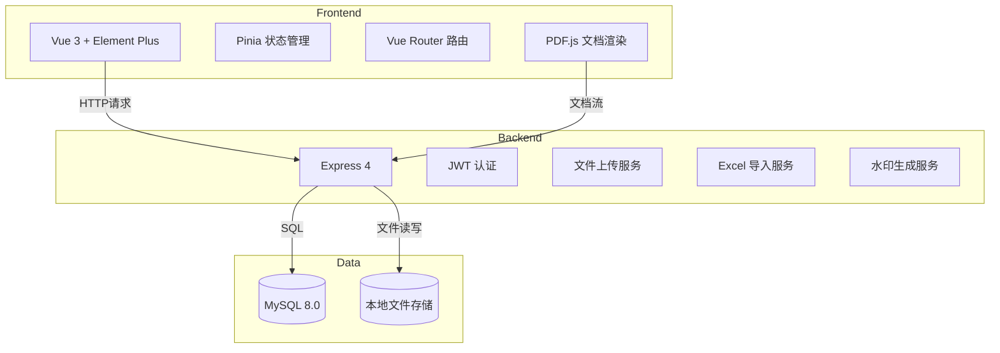
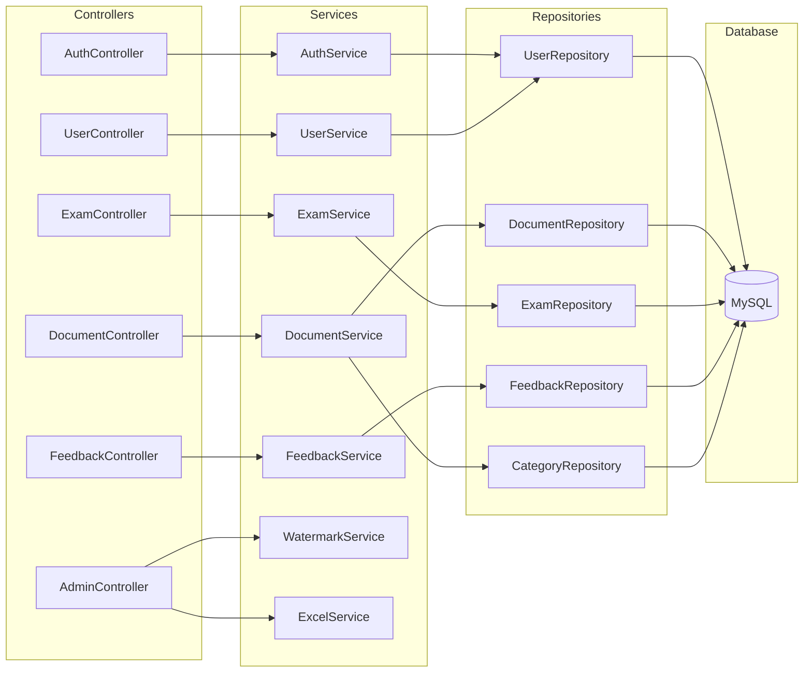
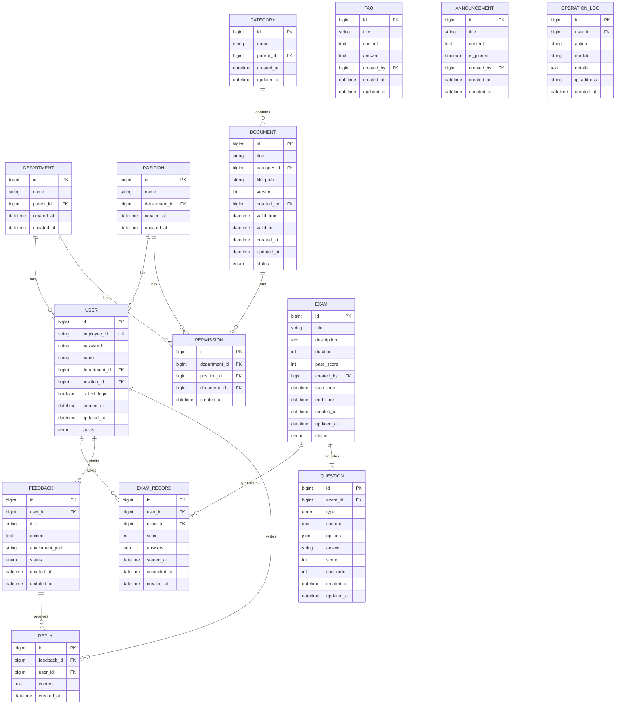

# 制度学习与问题反馈平台 - 技术架构文档

## 1. Architecture Design



## 2. Technology Description

- **前端**: Vue 3 + Element Plus + Pinia + Vue Router + PDF.js + Vite
- **初始化工具**: Vite
- **后端**: Express 4 + Node.js
- **数据库**: MySQL 8.0
- **认证**: JWT
- **文件处理**: Multer (上传) + pdf-lib (水印) + xlsx (Excel导入)

## 3. Route Definitions

### 3.1 前台路由 (Frontend)

| Route | Purpose |
|-------|---------|
| / | 前台首页 |
| /login | 登录页 |
| /documents | 制度学习列表 |
| /documents/:id | 制度详情/PDF查看 |
| /exams | 考试列表 |
| /exams/:id | 考试答题页 |
| /exams/history | 考试历史 |
| /feedback | 问题反馈列表 |
| /feedback/submit | 提交反馈 |
| /feedback/:id | 反馈详情 |
| /faq | 常见问题 |
| /profile | 个人中心 |

### 3.2 后台路由 (Admin)

| Route | Purpose |
|-------|---------|
| /admin | 后台首页 |
| /admin/login | 后台登录 |
| /admin/documents | 制度管理 |
| /admin/documents/create | 创建制度 |
| /admin/documents/:id/edit | 编辑制度 |
| /admin/categories | 分类管理 |
| /admin/exams | 考试管理 |
| /admin/exams/create | 创建考试 |
| /admin/questions | 题库管理 |
| /admin/users | 用户管理 |
| /admin/users/import | 批量导入用户 |
| /admin/departments | 部门管理 |
| /admin/positions | 岗位管理 |
| /admin/permissions | 权限设置 |
| /admin/feedback | 反馈管理 |
| /admin/faq | 常见问题管理 |
| /admin/statistics | 统计报表 |

### 3.3 API路由 (Backend)

| Route | Method | Purpose |
|-------|--------|---------|
| /api/auth/login | POST | 用户登录 |
| /api/auth/me | GET | 获取当前用户信息 |
| /api/auth/change-password | POST | 修改密码 |
| /api/documents | GET | 获取制度列表 |
| /api/documents/:id | GET | 获取制度详情 |
| /api/documents/:id/content | GET | 获取PDF内容（加水印） |
| /api/categories | GET | 获取分类列表 |
| /api/exams | GET | 获取考试列表 |
| /api/exams/:id | GET | 获取考试详情 |
| /api/exams/:id/submit | POST | 提交考试 |
| /api/exams/history | GET | 获取考试历史 |
| /api/feedback | GET | 获取反馈列表 |
| /api/feedback | POST | 提交反馈 |
| /api/feedback/:id | GET | 获取反馈详情 |
| /api/faq | GET | 获取常见问题 |
| /api/user/profile | GET | 获取个人信息 |
| /api/admin/documents | POST | 上传制度 |
| /api/admin/documents/:id | PUT | 编辑制度 |
| /api/admin/documents/:id | DELETE | 删除制度 |
| /api/admin/users | POST | 创建用户 |
| /api/admin/users/import | POST | 批量导入用户 |
| /api/admin/feedback/:id/reply | POST | 回复反馈 |

## 4. Server Architecture Diagram



## 5. Data Model

### 5.1 ER Diagram



### 5.2 DDL Statements

```sql
-- 用户表
CREATE TABLE users (
    id BIGINT PRIMARY KEY AUTO_INCREMENT,
    employee_id VARCHAR(50) UNIQUE NOT NULL COMMENT '工资编号',
    password VARCHAR(255) NOT NULL COMMENT '密码（加密存储）',
    name VARCHAR(100) NOT NULL COMMENT '姓名',
    department_id BIGINT COMMENT '部门ID',
    position_id BIGINT COMMENT '岗位ID',
    is_first_login BOOLEAN DEFAULT TRUE COMMENT '是否首次登录',
    status ENUM('active', 'inactive') DEFAULT 'active',
    created_at DATETIME DEFAULT CURRENT_TIMESTAMP,
    updated_at DATETIME DEFAULT CURRENT_TIMESTAMP ON UPDATE CURRENT_TIMESTAMP,
    INDEX idx_department (department_id),
    INDEX idx_position (position_id)
) ENGINE=InnoDB DEFAULT CHARSET=utf8mb4 COMMENT='用户表';

-- 部门表
CREATE TABLE departments (
    id BIGINT PRIMARY KEY AUTO_INCREMENT,
    name VARCHAR(100) NOT NULL,
    parent_id BIGINT COMMENT '父部门ID',
    created_at DATETIME DEFAULT CURRENT_TIMESTAMP,
    updated_at DATETIME DEFAULT CURRENT_TIMESTAMP ON UPDATE CURRENT_TIMESTAMP,
    INDEX idx_parent (parent_id)
) ENGINE=InnoDB DEFAULT CHARSET=utf8mb4 COMMENT='部门表';

-- 岗位表
CREATE TABLE positions (
    id BIGINT PRIMARY KEY AUTO_INCREMENT,
    name VARCHAR(100) NOT NULL,
    department_id BIGINT COMMENT '所属部门ID',
    created_at DATETIME DEFAULT CURRENT_TIMESTAMP,
    updated_at DATETIME DEFAULT CURRENT_TIMESTAMP ON UPDATE CURRENT_TIMESTAMP,
    INDEX idx_department (department_id)
) ENGINE=InnoDB DEFAULT CHARSET=utf8mb4 COMMENT='岗位表';

-- 分类表
CREATE TABLE categories (
    id BIGINT PRIMARY KEY AUTO_INCREMENT,
    name VARCHAR(100) NOT NULL,
    parent_id BIGINT COMMENT '父分类ID',
    sort_order INT DEFAULT 0,
    created_at DATETIME DEFAULT CURRENT_TIMESTAMP,
    updated_at DATETIME DEFAULT CURRENT_TIMESTAMP ON UPDATE CURRENT_TIMESTAMP,
    INDEX idx_parent (parent_id)
) ENGINE=InnoDB DEFAULT CHARSET=utf8mb4 COMMENT='分类表';

-- 制度文档表
CREATE TABLE documents (
    id BIGINT PRIMARY KEY AUTO_INCREMENT,
    title VARCHAR(200) NOT NULL,
    category_id BIGINT NOT NULL,
    file_path VARCHAR(500) NOT NULL COMMENT 'PDF文件路径',
    version INT DEFAULT 1,
    created_by BIGINT NOT NULL,
    valid_from DATETIME,
    valid_to DATETIME,
    status ENUM('draft', 'published', 'archived') DEFAULT 'draft',
    created_at DATETIME DEFAULT CURRENT_TIMESTAMP,
    updated_at DATETIME DEFAULT CURRENT_TIMESTAMP ON UPDATE CURRENT_TIMESTAMP,
    INDEX idx_category (category_id),
    INDEX idx_status (status)
) ENGINE=InnoDB DEFAULT CHARSET=utf8mb4 COMMENT='制度文档表';

-- 权限表
CREATE TABLE permissions (
    id BIGINT PRIMARY KEY AUTO_INCREMENT,
    department_id BIGINT,
    position_id BIGINT,
    document_id BIGINT NOT NULL,
    created_at DATETIME DEFAULT CURRENT_TIMESTAMP,
    UNIQUE KEY uk_perm (department_id, position_id, document_id),
    INDEX idx_document (document_id)
) ENGINE=InnoDB DEFAULT CHARSET=utf8mb4 COMMENT='权限表';

-- 考试表
CREATE TABLE exams (
    id BIGINT PRIMARY KEY AUTO_INCREMENT,
    title VARCHAR(200) NOT NULL,
    description TEXT,
    duration INT NOT NULL COMMENT '考试时长（分钟）',
    pass_score INT NOT NULL COMMENT '及格分数',
    created_by BIGINT NOT NULL,
    start_time DATETIME,
    end_time DATETIME,
    max_attempts INT DEFAULT 1 COMMENT '最大考试次数',
    status ENUM('draft', 'published', 'closed') DEFAULT 'draft',
    created_at DATETIME DEFAULT CURRENT_TIMESTAMP,
    updated_at DATETIME DEFAULT CURRENT_TIMESTAMP ON UPDATE CURRENT_TIMESTAMP,
    INDEX idx_status (status)
) ENGINE=InnoDB DEFAULT CHARSET=utf8mb4 COMMENT='考试表';

-- 考题表
CREATE TABLE questions (
    id BIGINT PRIMARY KEY AUTO_INCREMENT,
    exam_id BIGINT NOT NULL,
    type ENUM('single', 'multiple', 'judgment') NOT NULL,
    content TEXT NOT NULL COMMENT '题目内容',
    options JSON COMMENT '选项',
    answer VARCHAR(255) NOT NULL COMMENT '正确答案',
    score INT NOT NULL DEFAULT 10,
    sort_order INT DEFAULT 0,
    created_at DATETIME DEFAULT CURRENT_TIMESTAMP,
    updated_at DATETIME DEFAULT CURRENT_TIMESTAMP ON UPDATE CURRENT_TIMESTAMP,
    INDEX idx_exam (exam_id)
) ENGINE=InnoDB DEFAULT CHARSET=utf8mb4 COMMENT='考题表';

-- 考试记录表
CREATE TABLE exam_records (
    id BIGINT PRIMARY KEY AUTO_INCREMENT,
    user_id BIGINT NOT NULL,
    exam_id BIGINT NOT NULL,
    score INT,
    answers JSON COMMENT '用户答案',
    started_at DATETIME,
    submitted_at DATETIME,
    attempt_number INT DEFAULT 1,
    created_at DATETIME DEFAULT CURRENT_TIMESTAMP,
    INDEX idx_user (user_id),
    INDEX idx_exam (exam_id)
) ENGINE=InnoDB DEFAULT CHARSET=utf8mb4 COMMENT='考试记录表';

-- 问题反馈表
CREATE TABLE feedback (
    id BIGINT PRIMARY KEY AUTO_INCREMENT,
    user_id BIGINT NOT NULL,
    title VARCHAR(200) NOT NULL,
    content TEXT NOT NULL,
    attachment_path VARCHAR(500),
    status ENUM('pending', 'processing', 'resolved', 'closed') DEFAULT 'pending',
    created_at DATETIME DEFAULT CURRENT_TIMESTAMP,
    updated_at DATETIME DEFAULT CURRENT_TIMESTAMP ON UPDATE CURRENT_TIMESTAMP,
    INDEX idx_user (user_id),
    INDEX idx_status (status)
) ENGINE=InnoDB DEFAULT CHARSET=utf8mb4 COMMENT='问题反馈表';

-- 回复表
CREATE TABLE replies (
    id BIGINT PRIMARY KEY AUTO_INCREMENT,
    feedback_id BIGINT NOT NULL,
    user_id BIGINT NOT NULL,
    content TEXT NOT NULL,
    created_at DATETIME DEFAULT CURRENT_TIMESTAMP,
    INDEX idx_feedback (feedback_id)
) ENGINE=InnoDB DEFAULT CHARSET=utf8mb4 COMMENT='回复表';

-- 常见问题表
CREATE TABLE faq (
    id BIGINT PRIMARY KEY AUTO_INCREMENT,
    title VARCHAR(200) NOT NULL,
    content TEXT,
    answer TEXT NOT NULL,
    sort_order INT DEFAULT 0,
    created_by BIGINT NOT NULL,
    created_at DATETIME DEFAULT CURRENT_TIMESTAMP,
    updated_at DATETIME DEFAULT CURRENT_TIMESTAMP ON UPDATE CURRENT_TIMESTAMP
) ENGINE=InnoDB DEFAULT CHARSET=utf8mb4 COMMENT='常见问题表';

-- 公告表
CREATE TABLE announcements (
    id BIGINT PRIMARY KEY AUTO_INCREMENT,
    title VARCHAR(200) NOT NULL,
    content TEXT NOT NULL,
    is_pinned BOOLEAN DEFAULT FALSE,
    created_by BIGINT NOT NULL,
    created_at DATETIME DEFAULT CURRENT_TIMESTAMP,
    updated_at DATETIME DEFAULT CURRENT_TIMESTAMP ON UPDATE CURRENT_TIMESTAMP
) ENGINE=InnoDB DEFAULT CHARSET=utf8mb4 COMMENT='公告表';

-- 操作日志表
CREATE TABLE operation_logs (
    id BIGINT PRIMARY KEY AUTO_INCREMENT,
    user_id BIGINT NOT NULL,
    action VARCHAR(100) NOT NULL,
    module VARCHAR(100) NOT NULL,
    details TEXT,
    ip_address VARCHAR(50),
    created_at DATETIME DEFAULT CURRENT_TIMESTAMP,
    INDEX idx_user (user_id),
    INDEX idx_created (created_at)
) ENGINE=InnoDB DEFAULT CHARSET=utf8mb4 COMMENT='操作日志表';

-- 管理员表
CREATE TABLE admins (
    id BIGINT PRIMARY KEY AUTO_INCREMENT,
    username VARCHAR(50) UNIQUE NOT NULL,
    password VARCHAR(255) NOT NULL,
    name VARCHAR(100) NOT NULL,
    role ENUM('super_admin', 'admin') DEFAULT 'admin',
    status ENUM('active', 'inactive') DEFAULT 'active',
    created_at DATETIME DEFAULT CURRENT_TIMESTAMP,
    updated_at DATETIME DEFAULT CURRENT_TIMESTAMP ON UPDATE CURRENT_TIMESTAMP
) ENGINE=InnoDB DEFAULT CHARSET=utf8mb4 COMMENT='管理员表';

-- 初始化管理员（密码: admin123，实际使用请修改）
INSERT INTO admins (username, password, name, role) VALUES 
('admin', '$2b$10$N9qo8uLOickgx2ZMRZoMyeIjZAgcfl7p92ldGxad68LJZdL17lhWy', '超级管理员', 'super_admin');
```
