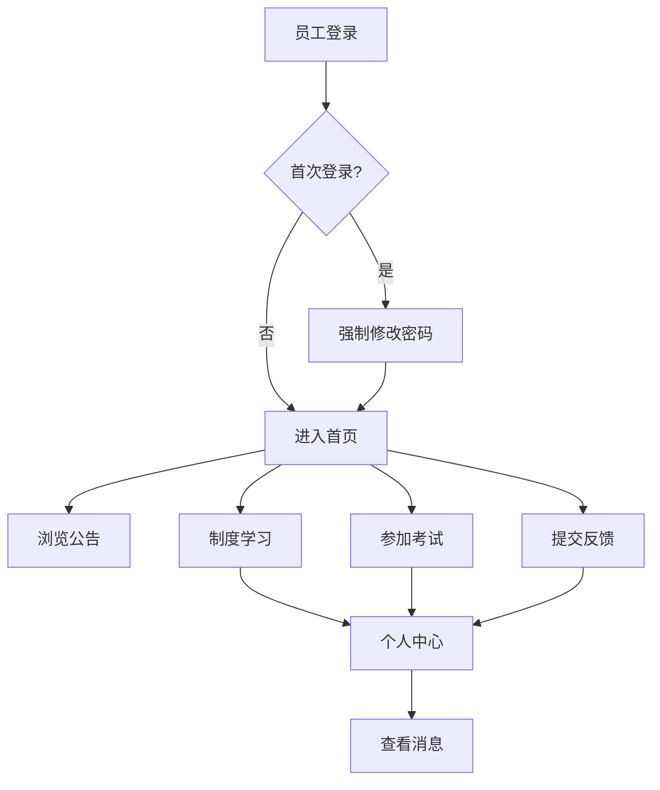
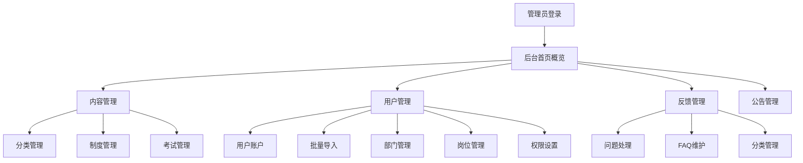
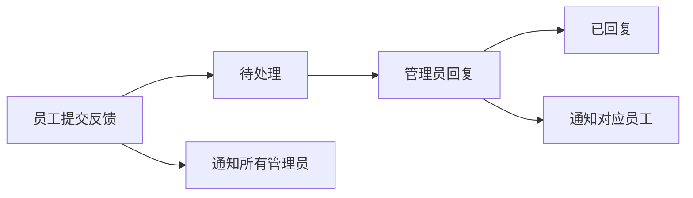

# 制度学习与问题反馈平台 — 产品需求文档 (PRD)

> **版本**: v4.0
> **日期**: 2026-04-24
> **状态**: 需求已确认
> **说明**: 本文档基于实施规格文档 v1.3 进行全面更新，确保PRD与实施规格完全对齐。

---

## 1. 产品概述

### 1.1 产品定位

制度学习与问题反馈平台是一个面向企业内部员工的学习管理系统，提供制度内容学习、在线考核测试和问题反馈功能，同时配备完整的后台管理系统。

### 1.2 核心价值

- 解决企业内部制度学习、考核和反馈的需求
- 提高员工对制度的理解和执行能力
- 为管理层提供有效的管理工具和数据支撑
- 建立制度学习、考核和反馈的完整闭环

### 1.3 目标用户

| 用户类型 | 说明 |
|----------|------|
| 企业员工 | 通过平台学习制度、参加考试、提交问题反馈 |
| 管理员 | 通过后台管理内容、用户、反馈，查看统计数据 |

### 1.4 技术栈

| 层级 | 技术 |
|------|------|
| 前端 | Vue 3 + Element Plus + Pinia + Axios + Vue Router + Vite |
| PDF | pdfjs-dist（前端渲染 + Canvas 水印） |
| Excel | ExcelJS（前后端共用） |
| 后端 | Express + TypeORM + jsonwebtoken + Multer + bcrypt + ExcelJS |
| 数据库 | MySQL 8.0 |
| API 风格 | RPC（`/api/xxxService.method`） |
| 认证 | JWT（无状态 Token） |
| 文件存储 | 本地存储（服务器目录） |
| 部署 | Docker + Docker Compose |

---

## 2. 用户角色与权限体系

### 2.1 角色定义

系统通过 `employee_type` 字段区分两种用户类型，共用同一张 `employees` 表：

| 角色 | employee_type | 权限范围 |
|------|---------------|----------|
| **管理员** | `admin` | 全部后台权限（部门/岗位/员工/制度/考试/反馈/公告/FAQ/数据看板） |
| **普通员工** | `employee` | 学习制度、参加考试、提交反馈、查看个人中心 |

> 管理员和普通员工使用同一登录接口，登录后根据 `employee_type` 自动路由到不同界面（管理员→后台，普通员工→前台）。

### 2.2 认证与安全策略

#### 登录方式

| 角色 | 登录方式 |
|------|----------|
| 管理员 | 工资编号（employee_no）+ 密码 |
| 普通员工 | 工资编号（employee_no）+ 密码 |

> 管理员和普通员工共用统一登录接口（`/api/authService.login`），通过 `employee_no + password` 登录。初始密码为身份证后六位（`id_card_last6`），首次登录强制修改密码。

#### 密码策略

- 密码长度至少 **8 位**，必须包含 **大写字母、小写字母和数字**
- **首次登录强制修改密码**

#### 密码找回/重置

- 用户通过"忘记密码"入口，输入 **工资编号 + 身份证后六位** 验证身份
- 验证通过后直接设置新密码
- 管理员可在后台重置用户密码（将 `first_login` 设为 true，用户下次登录需重新设置密码）

#### 登录安全策略（渐进锁定）

| 连续输错次数 | 锁定策略 |
|-------------|----------|
| 3 次 | 锁定 5 分钟 |
| 5 次 | 锁定 30 分钟 |
| 10 次及以上 | 锁定 60 分钟 |

- 锁定响应：`{ code: 423, message: "账号已锁定，请X分钟后重试", data: { lock_minutes: X } }`
- 禁用用户：返回 `{ code: 403, message: "账号已被禁用" }`

#### 管理员账号创建

- 系统部署时预设一个 **默认管理员** 账号（通过环境变量配置）
- 后续由管理员在后台创建其他管理员（创建时 `employee_type` 设为 `admin`）
- 管理员可在后台将普通员工和管理员互转

### 2.3 用户状态管理

- 支持 **启用/禁用** 状态（`active`/`disabled`）
- 禁用后用户无法登录系统
- **离职员工**：禁用账号，保留所有学习和考试历史记录，管理员可查询

---

## 3. 功能实现路径

> 本章按**功能依赖关系**和**后端→后台→前台**的实现顺序组织，确保每一步都有前置基础。

### 3.1 实现阶段总览

```
阶段1：基础设施 ─────────────────────────────────────────────
  │  项目初始化、数据库、认证、通知系统、管理员登录
  │
阶段2：组织架构 ─────────────────────────────────────────────
  │  部门管理 → 岗位管理 → 员工管理 → 批量导入 → 权限设置
  │
阶段3：后台内容管理 ─────────────────────────────────────────
  │  公告管理 → 制度分类 → 制度管理 → 考试管理
  │  → 反馈分类 → FAQ管理
  │
阶段4：前台功能 ─────────────────────────────────────────────
  │  员工登录/首页 → 制度学习 → 在线考试 → 问题反馈
  │  → 个人中心 → 通知中心
  │
阶段5：关联与收尾 ───────────────────────────────────────────
     版本管理 → 反馈处理 → 数据看板
```

### 3.2 功能依赖关系

| 阶段 | 功能模块 | 依赖 |
|------|----------|------|
| **阶段1** | 项目初始化、数据库设计 | 无 |
| **阶段1** | 用户认证（统一登录/密码/锁定） | 数据库 |
| **阶段1** | 通知系统 | 数据库 |
| **阶段1** | 管理员登录 | 用户认证 |
| **阶段2** | 部门管理 | 阶段1 |
| **阶段2** | 岗位管理 | 部门管理 |
| **阶段2** | 员工账户管理 | 部门管理、岗位管理 |
| **阶段2** | 批量导入用户 | 员工账户管理、部门管理、岗位管理 |
| **阶段2** | 权限设置 | 部门管理、岗位管理、制度管理 |
| **阶段3** | 公告管理 | 通知系统 |
| **阶段3** | 制度分类管理 | 无 |
| **阶段3** | 制度文档管理 | 制度分类、权限设置 |
| **阶段3** | 考试管理（含题目管理） | 制度管理 |
| **阶段3** | 反馈分类管理 | 无 |
| **阶段3** | FAQ管理 | 无 |
| **阶段4** | 员工登录/首页 | 阶段1 |
| **阶段4** | 制度学习（PDF/进度/筛选） | 制度管理、权限设置、通知系统 |
| **阶段4** | 在线考试 | 考试管理 |
| **阶段4** | 问题反馈 | 反馈分类、通知系统 |
| **阶段4** | 个人中心 | 制度学习、在线考试、通知系统 |
| **阶段5** | 制度版本管理 | 制度管理、通知系统 |
| **阶段5** | 反馈处理 | 反馈管理、通知系统 |
| **阶段5** | 数据看板 | 所有后台模块 |

---

## 4. 功能详细说明

> 本章按**实现阶段**组织，每个阶段内按**后端/后台→前台**顺序描述。

---

### 阶段1：基础设施

#### 1.1 用户认证体系

**统一登录**

| 功能点 | 说明 |
|--------|------|
| 统一登录接口 | 管理员和普通员工共用 `/api/authService.login`，通过 `employee_no + password` 登录 |
| 登录响应 | 返回 `{ token, employee_type, first_login }`，前端据此路由到不同界面 |
| 首次登录 | 强制修改密码（8位以上，含大小写字母和数字） |
| 密码找回 | 通过工资编号 + 身份证后六位验证身份，验证通过后设置新密码 |
| 登录安全 | 三级渐进锁定：3次→5分钟，5次→30分钟，10次→60分钟 |
| 用户状态 | 支持 **启用/禁用** 状态，禁用后无法登录；离职员工禁用账号，保留历史记录 |

#### 1.2 通知系统

**后端 — 站内消息基础能力**

- 统一使用 **站内消息通知**
- 支持按用户/角色发送通知
- 通知存储、已读/未读状态管理
- 支持未读数量查询、单条已读、全部已读

---

### 阶段2：组织架构

#### 2.1 后台 — 部门管理

- **扁平部门**，无层级关系
- 创建、编辑、删除部门
- 删除时检查：有关联岗位或员工时禁止删除

#### 2.2 后台 — 岗位管理

- **一个岗位对应一个部门，一个部门对应多个岗位**
- 创建、编辑、删除岗位

#### 2.3 后台 — 员工账户管理

| 功能点 | 说明 |
|--------|------|
| 用户列表 | 查看所有用户（支持按姓名、部门、岗位、状态、用户类型筛选） |
| 创建用户 | 手动创建用户（支持创建管理员和普通员工） |
| 编辑用户 | 编辑用户信息（不允许修改工资编号和身份证后六位） |
| 类型互转 | 支持管理员↔普通员工互转 |
| 启用/禁用 | 启用或禁用用户账号 |
| 重置密码 | 管理员重置用户密码（将 first_login 设为 true） |

> 管理员创建时 `department_id` 和 `position_id` 可为 NULL；将普通员工改为管理员时也可置为 NULL；将管理员改为普通员工时不能为 NULL。

#### 2.4 后台 — 批量导入用户

| 功能点 | 说明 |
|--------|------|
| 导入字段 | 姓名、工资编号、身份证后六位、部门、岗位 |
| 模板下载 | 提供Excel模板下载 |
| 失败处理 | 失败的行跳过并生成错误报告，成功的行正常导入 |

#### 2.5 后台 — 权限设置

- 同时支持 **部门 + 岗位** 两种维度
- 取 **并集**（员工满足部门或岗位任一条件即关联对应制度，需学习并考试）
- 在制度管理中设置每个制度的权限

---

### 阶段3：后台内容管理

#### 3.1 后台 — 公告管理

| 功能点 | 说明 |
|--------|------|
| 创建公告 | 仅支持 **单行文本**（非富文本） |
| 编辑公告 | 修改公告内容 |
| 上下线 | 控制公告的显示/隐藏 |
| 排序 | 调整公告的显示顺序 |
| 发布通知 | 公告上线时发送站内通知给 **全体普通员工** |

#### 3.2 后台 — 制度分类管理

- 创建、编辑、删除制度分类
- 支持**树形分类结构**（含系统内置分类）
- **系统内置分类**：部署时自动创建"旧制度"分类（`is_system=1`），不允许删除和编辑名称
- 删除分类时级联删除子分类

#### 3.3 后台 — 制度文档管理

| 功能点 | 说明 |
|--------|------|
| 上传制度文档 | 上传 PDF 文件 |
| 设置分类 | 将制度归入对应分类 |
| 设置权限 | 按部门、岗位关联制度，关联的部门/岗位人员必须学习并考试 |
| 上下线管理 | 手动控制制度的上线和下线 |
| 上线通知 | 制度上线时发送站内通知给 **关联部门/岗位的员工** |

#### 3.4 后台 — 考试管理

> PRD旧版中的"试卷管理"已合并到考试管理中，考试直接包含题目内容。

| 功能点 | 说明 |
|--------|------|
| 创建考试（手动录入） | 设置考试名称、说明、及格分数线，直接录入题目（单选题、多选题、判断题） |
| 创建考试（文件上传） | 支持 Excel（.xlsx）和 JSON（.json）格式文件上传，自动解析题目 |
| 题目编辑 | 编辑考试中的题目内容（题型、选项、答案、解析） |
| 关联制度 | 一个考试可关联多个制度；参加考试人员 = 所有关联制度权限（部门/岗位）的并集 |
| 发布/下线 | 控制考试的发布状态 |
| 发布通知 | 考试发布时发送站内通知给 **关联制度权限（部门/岗位并集）的员工** |

**Excel上传格式**：每行一题，列包含 题型/题目内容/选项A/选项B/选项C/选项D/正确答案/解析

#### 3.5 后台 — 反馈分类管理

- 创建、编辑、删除反馈分类（如制度疑问、系统问题、建议等）

#### 3.6 后台 — FAQ管理

- 创建、编辑、删除常见问题
- 支持排序调整
- FAQ在前台展示，帮助员工自助解决问题

---

### 阶段4：前台功能

#### 4.1 前台 — 员工登录与首页

**登录页**

- 工资编号 + 密码登录（管理员和员工共用）
- 首次登录强制修改密码
- 密码找回入口

**首页**

| 模块 | 说明 |
|------|------|
| 导航栏 | 系统名称、各功能模块入口、用户信息/退出 |
| 公告栏 | 显示系统重要公告（仅单行文本，仅 online 状态） |
| 快捷入口 | 制度学习入口、考试入口、反馈入口 |

#### 4.2 前台 — 制度学习

**分类浏览**
- **树形分类**展示制度文档
- 按分类筛选制度
- 分类由管理员在后台维护

**搜索与筛选**
- 支持 **标题 + 摘要** 关键词搜索
- 支持按 **学习状态** 筛选：
  - `all`：全部（默认）
  - `required`：应学（关联了员工所在部门/岗位的制度）
  - `unfinished`：应学未学（关联但尚未完成学习）
  - `completed`：已学完

**PDF 文档展示**

| 功能点 | 说明 |
|--------|------|
| 在线渲染 | 在浏览器中直接渲染 PDF 文档（pdfjs-dist） |
| 水印 | Canvas 叠加层，全页平铺"姓名 + 日期时间"，半透明显示 |
| 安全防护 | 禁用下载、打印、右键菜单、文本选择、快捷键（Ctrl+S/Ctrl+P/Ctrl+Shift+I） |
| 移动端适配 | 支持双指缩放、横向滚动 |
| 服务端防护 | JWT验证、流式返回、禁止缓存（`Cache-Control: no-store, no-cache`） |

**学习进度追踪**
- 员工手动点击"标记已学完"按钮完成学习
- 记录每个制度文档的学习完成状态和完成时间

**访问权限与学习要求**
- **制度所有人可见**：所有员工均可浏览和查看所有已发布的制度文档
- **学习要求按岗位/部门关联**：制度与部门/岗位关联，只有关联的岗位/部门人员**必须学习该制度并参加对应考试**
- **制度列表筛选**：制度列表页支持按学习状态筛选，**突出显示员工"应学未学"的制度**
- 考试与学习 **相互独立**，不需要强制学完才能参加考试

**考试快捷入口**
- 制度列表中每个制度项提供 **"进入考试"按钮**，方便员工直接进入对应考试
- PDF查看器页面也提供 **"进入考试"按钮**

#### 4.3 前台 — 在线考试

**考试规则**

| 规则项 | 说明 |
|--------|------|
| 试卷类型 | 固定试卷（管理员手动选题组卷或文件上传） |
| 考试次数 | **不限次数**，取最高分 |
| 考试时长 | **不限时**，手动提交 |
| 防作弊 | 企业内部考试信任员工，**不需要防作弊措施** |
| 及格分数线 | 每次考试设定 **及格分数线** |

**题型**

| 题型 | 说明 |
|------|------|
| **单选题** | 4 个选项中选 1 个正确答案 |
| **多选题** | 2 个或以上正确答案 |
| **判断题** | 正确/错误 |

**评分逻辑**

| 题型 | 评分规则 |
|------|----------|
| 单选题 | 精确匹配 |
| 多选题 | 完全匹配（排序无关） |
| 判断题 | 精确匹配 |
| 分值计算 | 每题分值 = 100 / 总题数（取整），总分 = 各题得分之和 |
| 及格判定 | score >= pass_score |

**功能模块**

| 模块 | 说明 |
|------|------|
| 考试列表 | 展示可参加的考试（显示最高分和是否及格） |
| 在线答题 | 支持单选题、多选题、判断题的在线作答，显示答题进度 |
| 自动评分 | 提交后立即显示成绩、正确答案和解析 |
| 考试历史 | 查看历次考试成绩 |
| 考试详情 | 查看每道题的题目、用户答案、正确答案和解析 |

#### 4.4 前台 — 问题反馈

**反馈提交**

| 功能点 | 说明 |
|--------|------|
| 提交内容 | 支持标题、内容输入 |
| 附件上传 | 每个反馈最多 **5 个** 附件，每个不超过 **10MB**，不限制附件格式 |
| 反馈分类 | 支持分类（如制度疑问、系统问题、建议等），分类由管理员维护 |
| 优先级 | **无优先级** |

**反馈状态流转**

```
待处理（pending） → 已回复（replied）
```

**常见问题（FAQ）**
- 员工可在前台浏览常见问题列表（按 sort_order 排序）

#### 4.5 前台 — 个人中心

| 模块 | 说明 |
|------|------|
| 个人信息 | 展示姓名、部门、岗位 |
| 学习统计 | 制度学习完成率（应学制度数、已完成数、完成率） |
| 考试统计 | 参加考试次数、最高成绩、是否及格 |
| 学习记录 | 已学习的制度列表及学习状态 |
| 考试记录 | 列表页：考试名称、成绩、是否及格、时间；详情页：每道题的题目、用户答案、正确答案 |
| 通知中心 | 查看站内消息和系统通知，支持未读数量、标记已读、全部已读 |

#### 4.6 前台 — 通知中心

| 功能点 | 说明 |
|--------|------|
| 通知列表 | 分页查看通知 |
| 未读数量 | 显示未读通知数量 |
| 标记已读 | 单条通知标记已读 |
| 全部已读 | 一键标记所有通知为已读 |

---

### 阶段5：关联与收尾

#### 5.1 后台 — 制度版本管理

| 功能点 | 说明 |
|--------|------|
| 版本保留 | 上传新版本时保留旧版本（存入 regulation_versions 表），旧版本移入"旧制度"分类 |
| 重新学习 | 新版本发布后，已学习过的用户的学习状态重置为未完成 |
| 版本通知 | 新版本发布时给已学习过的用户发送站内通知 |

**版本更新完整流程：**
1. 旧版本存入 regulation_versions
2. 旧制度 `is_latest=0`，`status=offline`，`category_id` 改为系统内置"旧制度"分类
3. 创建新制度记录 `is_latest=1`
4. 重置已学习员工的 `employee_learning.is_completed=0`
5. 发送站内通知给已学习员工

#### 5.2 后台 — 反馈处理

| 功能点 | 说明 |
|--------|------|
| 反馈列表 | 查看所有用户提交的反馈（支持按状态、分类筛选） |
| 处理反馈 | 管理员直接回复，状态从"待处理"变为"已回复" |
| 反馈通知 | 员工提交反馈后通知 **所有管理员**；管理员回复后通知 **对应员工** |

#### 5.3 后台 — 数据看板

| 指标 | 说明 |
|------|------|
| 员工总数 | 系统中注册的员工总数 |
| 制度总数 | 已发布的制度文档总数 |
| 考试总数 | 已发布的考试总数 |
| 待处理反馈数 | 当前待处理的反馈数量 |

提供快捷操作入口（新建制度、发布考试、处理反馈）。

#### 5.4 通知场景汇总

| 场景 | 触发时机 | 通知对象 | 触发 API |
|------|----------|----------|----------|
| 新公告发布 | 公告上线时 | 全体普通员工 | announcementService.updateStatus |
| 新制度上架 | 制度上线时 | 关联部门/岗位的员工 | regulationService.updateStatus |
| 制度版本更新 | 上传新版本时 | 已学习过该制度的员工 | regulationService.newVersion |
| 新考试发布 | 考试发布时 | 关联制度权限（部门/岗位并集）的员工 | examService.updateStatus |
| 反馈提交 | 员工提交反馈时 | 所有管理员（employee_type='admin'） | feedbackService.create |
| 反馈回复 | 管理员回复时 | 对应员工 | feedbackService.reply |

> 注：考试完成不发送通知，成绩在答题页面直接展示。

---

## 5. 核心业务流程

### 5.1 员工学习流程

1. 员工使用工资编号和密码登录系统
2. 首次登录强制修改密码
3. 浏览公告栏，了解最新动态
4. 进入制度学习页面，浏览/搜索制度文档
5. 查看 PDF 文档（带水印），手动标记已学完
6. 参加相关考试（不限次数，取最高分）
7. 如有疑问提交反馈
8. 在个人中心查看学习和考试记录



### 5.2 管理员管理流程

1. 管理员使用工资编号和密码登录后台管理系统
2. 查看数据概览
3. 批量导入用户或手动创建用户
4. 创建制度分类和部门/岗位
5. 上传制度文档并设置权限
6. 配置访问权限（部门 + 岗位并集）
7. 创建考试（手动录入题目或文件上传）并关联制度
8. 处理员工反馈问题
9. 管理公告



### 5.3 制度版本更新流程

1. 管理员上传制度新版本
2. 系统保留旧版本（存入版本表），旧版本移入"旧制度"分类并下线
3. 系统向已学习过该制度的员工发送站内通知
4. 已学习过的员工的学习状态重置为未完成，需重新学习确认

### 5.4 反馈处理流程



---

## 6. 技术约束

### 6.1 性能要求

| 指标 | 要求 |
|------|------|
| 并发规模 | 50 人以下 |
| 响应时间 | 操作响应 < 2 秒 |
| 可用性 | 99% 以上 |

### 6.2 前端要求

| 设计项 | 说明 |
|--------|------|
| 移动端形态 | 纯 H5 响应式（一个网址，自适应 PC 和手机浏览器） |
| 设计原则 | Desktop-first，自适应移动端 |
| 响应式断点 | ≥1200px（PC桌面）、768-1199px（平板）、<768px（手机） |
| 移动端导航 | 底部导航，侧边栏改为抽屉式 |
| PDF 查看 | 移动端支持双指缩放，横向滚动 |
| 触摸优化 | 移动端触摸手势优化 |

### 6.3 安全要求

- 密码存储：bcrypt 加密存储
- 登录保护：三级渐进锁定机制
- 文档安全：PDF 禁止下载/打印，前端渲染加水印，服务端 JWT 验证 + 禁止缓存
- API 认证：JWT 无状态 Token，24小时过期（可配置）

### 6.4 部署要求

- 部署方式：**Docker + Docker Compose**
- 系统架构：前后端分离
- 文件存储：本地存储（服务器目录）

### 6.5 非功能需求

- **错误处理**：使用统一的错误提示组件
- **多端同步**：PC 端和移动端数据实时同步
- **操作日志**：不需要
- **数据导出**：不需要

---

## 7. 页面清单

> 按实现阶段分类，每个阶段内按后台→前台顺序列出页面。

### 阶段1：基础设施

| 端 | 页面 | 路由 | 组件文件 | 功能 |
|------|------|------|----------|------|
| 前台 | 统一登录 | /login | views/front/Login.vue | 管理员和员工共用登录、首次改密、密码找回 |

### 阶段2：组织架构

| 端 | 页面 | 路由 | 组件文件 | 功能 |
|------|------|------|----------|------|
| 后台 | 部门管理 | /admin/departments | views/admin/department/DepartmentList.vue | 扁平部门 CRUD |
| 后台 | 岗位管理 | /admin/positions | views/admin/position/PositionList.vue | 岗位 CRUD |
| 后台 | 员工列表 | /admin/employees | views/admin/employee/EmployeeList.vue | 员工 CRUD、搜索筛选、启用/禁用、类型筛选 |
| 后台 | 批量导入 | /admin/employees/import | views/admin/employee/EmployeeImport.vue | Excel 导入 |

### 阶段3：后台内容管理

| 端 | 页面 | 路由 | 组件文件 | 功能 |
|------|------|------|----------|------|
| 后台 | 公告管理 | /admin/announcements | views/admin/announcement/AnnouncementList.vue | 公告 CRUD + 排序 |
| 后台 | 分类管理 | /admin/regulation-categories | views/admin/regulation/CategoryList.vue | 树形分类 CRUD（系统分类不可删/改） |
| 后台 | 制度管理 | /admin/regulations | views/admin/regulation/RegulationList.vue | 制度 CRUD + 权限设置 |
| 后台 | 考试管理 | /admin/exams | views/admin/exam/ExamList.vue | 考试 CRUD + 题目编辑 + 文件上传 + 关联制度 |
| 后台 | 反馈分类 | /admin/feedback-categories | views/admin/feedback/CategoryList.vue | 反馈分类 CRUD |
| 后台 | FAQ管理 | /admin/faqs | views/admin/faq/FaqList.vue | FAQ CRUD + 排序 |

### 阶段4：前台功能

| 端 | 页面 | 路由 | 组件文件 | 功能 |
|------|------|------|----------|------|
| 前台 | 首页 | / | views/front/Home.vue | 导航栏 + 公告 + 快捷入口 |
| 前台 | 制度列表 | /regulations | views/front/regulation/RegulationList.vue | 分类/搜索/应学未学筛选 + 进入考试按钮 |
| 前台 | PDF查看器 | /regulations/:id/pdf | views/front/regulation/PdfViewer.vue | pdf.js + 水印 + 安全防护 + 进入考试按钮 |
| 前台 | 考试列表 | /exams | views/front/exam/ExamList.vue | 可参加的考试 |
| 前台 | 答题界面 | /exams/:id/taking | views/front/exam/ExamTaking.vue | 在线答题 |
| 前台 | 考试历史 | /exams/history | views/front/exam/ExamHistory.vue | 历次成绩 |
| 前台 | 提交反馈 | /feedback/submit | views/front/feedback/FeedbackSubmit.vue | 提交 + 附件 |
| 前台 | 反馈列表 | /feedback/list | views/front/feedback/FeedbackList.vue | 状态/回复 |
| 前台 | FAQ | /feedback/faq | views/front/feedback/FaqList.vue | 常见问题 |
| 前台 | 个人中心 | /profile | views/front/profile/Profile.vue | 信息 + 统计 |
| 前台 | 学习记录 | /profile/learning | views/front/profile/LearningRecords.vue | 学习列表 |
| 前台 | 考试记录 | /profile/exams | views/front/profile/ExamRecords.vue | 考试列表 + 详情 |
| 前台 | 通知中心 | /profile/notifications | views/front/profile/Notifications.vue | 站内消息 |

### 阶段5：关联与收尾

| 端 | 页面 | 路由 | 组件文件 | 功能 |
|------|------|------|----------|------|
| 后台 | 数据看板 | /admin | views/admin/Dashboard.vue | 统计卡片 + 快捷操作 |
| 后台 | 反馈列表 | /admin/feedbacks | views/admin/feedback/FeedbackList.vue | 反馈列表 + 回复 |

---

## 8. 公共组件

| 组件 | 文件 | 说明 |
|------|------|------|
| PdfViewer | components/PdfViewer.vue | pdf.js 渲染 + Canvas 水印叠加 + 安全防护 |
| WatermarkCanvas | components/WatermarkCanvas.vue | 水印生成（姓名+日期时间，半透明平铺） |
| ExcelImport | components/ExcelImport.vue | Excel 上传 + 结果展示 |
| FileUpload | components/FileUpload.vue | 通用文件上传（限制数量/大小） |

---

## 9. 附录

### 9.1 术语表

| 术语 | 定义 |
|------|------|
| 应学未学 | 制度关联了员工所在部门/岗位，但员工尚未完成学习 |
| 旧制度分类 | 系统内置分类（is_system=1），制度更新后旧版本自动归入此分类 |
| 渐进锁定 | 根据连续登录失败次数递增锁定时长的安全机制（三级：5分钟/30分钟/60分钟） |
| 统一登录 | 管理员和普通员工共用同一登录接口，通过 employee_type 区分角色 |

### 9.2 版本记录

| 版本 | 日期 | 修改内容 |
|------|------|----------|
| v1.0 | 2026-04-22 | 原始 PRD 第一版 |
| v2.0 | 2026-04-22 | 原始 PRD 第二版（37 项缺口闭环） |
| v3.0 | 2026-04-22 | 合并两份 PRD，经需求确认后整合为统一版本 |
| v3.1 | 2026-04-23 | 功能模块按业务领域重新分类（A~E五大模块），每类按前台/后台组织；页面清单同步调整 |
| v3.2 | 2026-04-23 | 制度改为所有人可见，学习/考试要求按部门/岗位关联；制度列表增加"应学未学"筛选 |
| v3.3 | 2026-04-23 | 按功能依赖关系重排为5个实现阶段（基础设施→组织架构→后台内容管理→前台功能→关联收尾），每阶段内按后端/后台→前台顺序 |
| v3.4 | 2026-04-23 | 移除解锁账号和更新已有用户功能；题库管理改为试卷管理（每个制度对应一套试卷，管理员直接上传） |
| v4.0 | 2026-04-24 | 基于实施规格文档 v1.3 全面更新：统一登录接口、角色简化为admin/employee、三级渐进锁定、考试与试卷合并、手动标记已学完、移除阅读时长、数据看板指标调整、通知对象精确化、响应式断点简化、Docker部署、新增技术栈/公共组件/路由信息 |
